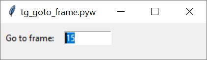

# tg-go-to-frame
Sets the current frame in the Terragen project.

### Requirements
Terragen 4 Professional v4.6.31 (or later)  
https://planetside.co.uk/

### Installation
Install Terragen 4 Professional v4.6.31 or greater on your computer.

In this repository you’ll find two Python scripts, which are identical except for their file extensions.  The file ending in .PY will open a command window when run, while the file ending in .PYW will not.  I recommend using the file with the .PYW extension when the script is run or called from an external file or controller device like a Tourbox.

### Usage
When run, the UI presents a single Entry widget called “<b>Go to frame</b>” which accepts integer values. The default value is the current frame, and this value can be retrieved at any time by pressing the <b>Escape key</b>.   The current frame and timeline will automatically update as characters are entered.  The <b>Up Arrow</b> and <b>Down Arrow</b> will advance the current frame forward or backwards respectively by one frame.  Scrolling the <b>middle mouse button</b> will advance the “Go to frame” value, but you must click another key, such as the <b>Enter</b> key, to set the current frame and update the timeline.

### Reference
terragen-rpc  
https://github.com/planetside-software/terragen-rpc

Online documentation for Terragen RPC  
https://planetside.co.uk/docs/terragen-rpc/

Blog posts on using Terragen RPC  
https://planetside.co.uk/blog/hello-rpc-part-1-scripting-for-terragen/  
https://planetside.co.uk/blog/hello-rpc-part-2-error-handling/  
https://planetside.co.uk/blog/script-it-yourself-kelvin-sunlight-colour-with-terragen-rpc/

